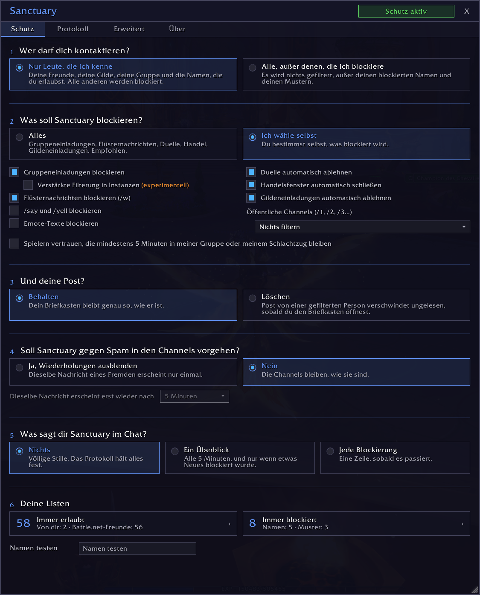
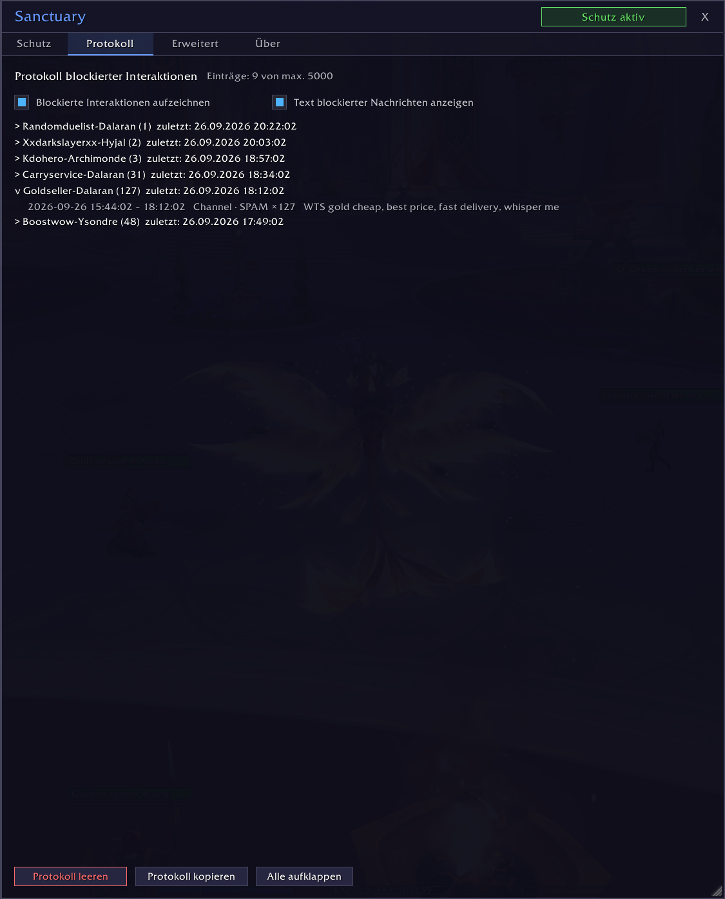
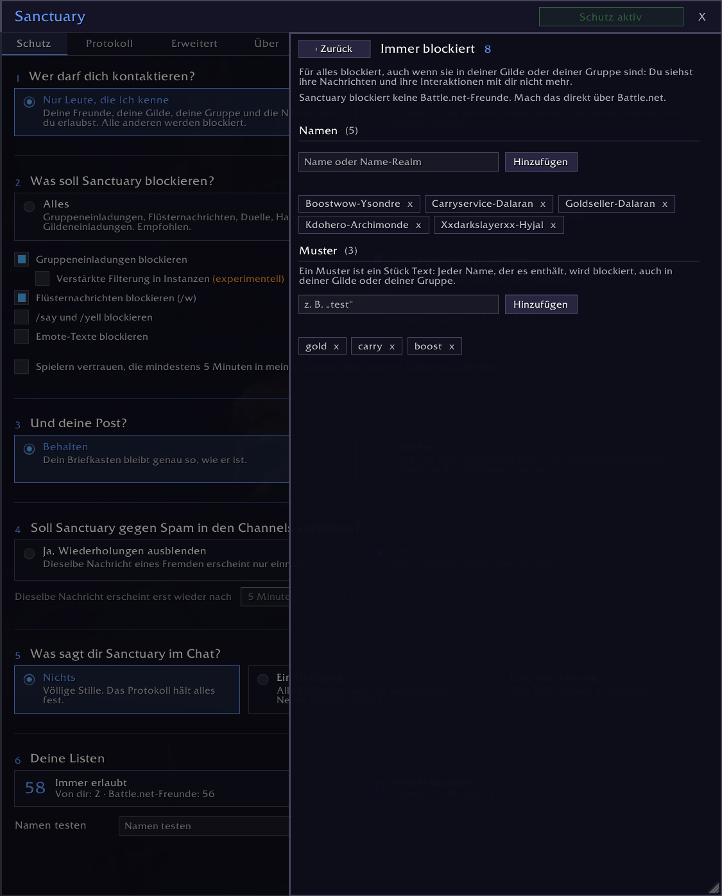
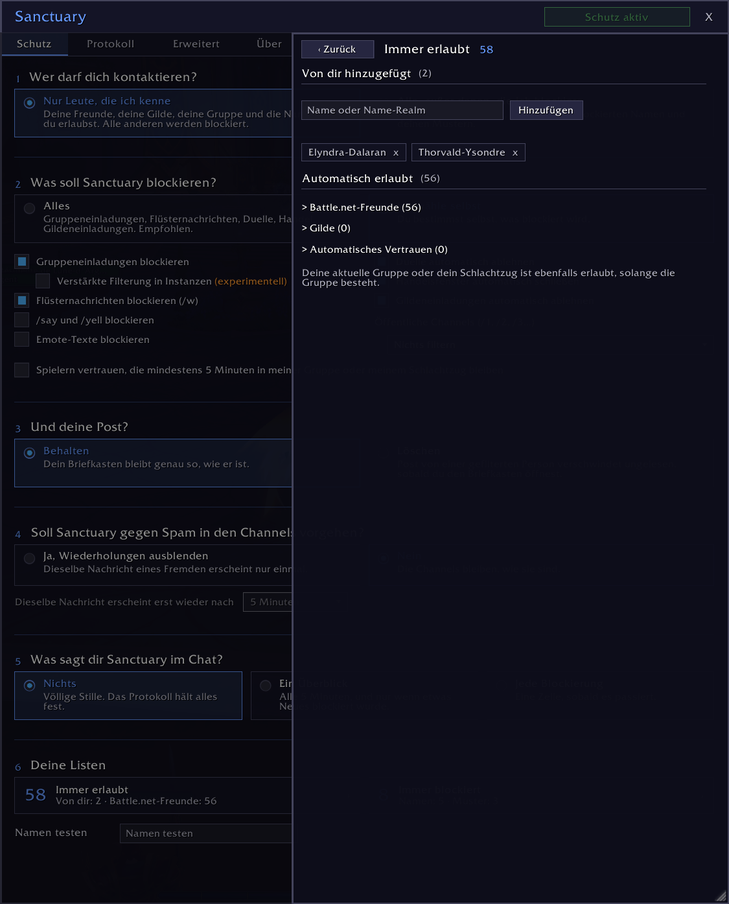

# Sanctuary

> Schutz vor Belästigung und Spam für World of Warcraft: Sanctuary blockiert Einladungen, Nachrichten, Flüsternachrichten und andere toxische Interaktionen von Spielern, die dir schaden wollen, bevor sie dich stören können.

*[English](README.md) · [Français](README.fr.md) · [Deutsch](README.de.md) · [Español](README.es.md) · [Português](README.pt.md) · [Русский](README.ru.md) · [Italiano](README.it.md)*

*Diese Übersetzung ist ein Entwurf, den noch kein Muttersprachler geprüft hat. Korrekturen sind auf GitHub willkommen.*

## Was Sanctuary macht

Standardmäßig können dich nur Spieler kontaktieren, die du kennst. Ein zweiter Modus lässt alle durch, außer den Spielern, die du per Name oder per Muster blockiert hast.

Blockierte Interaktionen hinterlassen keine Spur: kein Fenster, keine Nachricht, kein Sound.

**Was Sanctuary blockieren kann:**
- Gruppen- und Gildeneinladungen
- Flüsternachrichten von WoW-Charakteren (nie die von Battle.net)
- Duelle und Handel
- /say, /yell und Emotes
- Spam in den öffentlichen Channels
- Post von gefilterten Personen, wenn du den Briefkasten öffnest

**Immer durchgelassen werden:**
- deine Gilde
- deine Freunde
- deine aktuelle Gruppe oder dein Schlachtzug
- die Namen, die du erlaubt hast

## Warum Sanctuary

Die meisten Addons arbeiten mit einer Liste blockierter Spieler: Du blockierst einen Spieler, alle anderen kommen durch. Wer dich belästigt, wechselt den Charakter und fängt wieder an. Sanctuary macht das Gegenteil möglich: Nur Leute, denen du vertraust, erreichen dich, Fremde werden von vornherein blockiert. Die Liste „Immer blockiert“ gibt es auch, mit Mustern: Ein Teil eines Namens reicht, um eine ganze Familie von Charakteren zu blockieren.

Das Protokoll hält alles fest, was blockiert wurde, mit Uhrzeit, Typ und Nachricht. Wiederholter Spam zählt nur einmal, mit der Anzahl seiner Wiederholungen.

## Installation

Am einfachsten: Installiere Sanctuary über CurseForge, mit der App oder über die Projektseite.

Von Hand:

1. Lade dieses Repository herunter.
2. Kopiere den Ordner nach `World of Warcraft/_retail_/Interface/AddOns/Sanctuary/`.
3. Achte darauf, dass der Ordner `Sanctuary` heißt.
4. Starte WoW neu oder gib `/reload` ein.

## Verwendung

Klicke auf das Sanctuary-Symbol an der Minikarte oder gib `/sanc` ein, um das Fenster zu öffnen.

Der Hauptbildschirm stellt sechs Fragen: wer dich kontaktieren darf, was Sanctuary blockieren soll, was es mit deiner Post macht, ob Spam in den öffentlichen Channels ausgeblendet werden soll, was dir Sanctuary im Chat sagt und deine Listen.

Die Option „Verstärkte Filterung in Instanzen (experimentell)“ hat ein eigenes Kästchen. Wenn WoW den Chat sperrt (Instanzbosse, Mythische Schlüsselsteine, PvP-Matches), können Addons keine Systemnachrichten mehr lesen. Ist diese Option aktiv und bist du in einer Gruppe oder Instanz, blendet Sanctuary jede Systemnachricht aus, nicht nur Einladungen. Schalte sie nur ein, wenn dich in einem Dungeon, einem Schlachtzug oder im PvP noch unerwünschte Einladungen erreichen.

## Deine Post

Post von einer gefilterten Person wird gelöscht, wenn du den Briefkasten öffnest, nicht vorher: Das Spiel hat sie schon zugestellt. Damit sie gar nicht erst verschickt wird, nutze die Blizzard-Funktion „Ignorieren“. Post, die nicht von einem Spieler stammt, wird niemals angerührt. Deine anderen Charaktere gelten als Fremde: Füge sie zu „Immer erlaubt“ hinzu, wenn du dir selbst Post schickst.

Standardmäßig lässt Sanctuary deine Post in Ruhe. Wenn du „Löschen“ wählst, erscheinen zwei Einstellungen: was es mit Post macht, die Gegenstände oder Geld enthält, und das Postsymbol an der Minikarte.

Das Postsymbol an der Minikarte richtet sich nach den Namen der Absender. Post von einem NSC kann es deshalb ausblenden. Wenn du den Briefkasten öffnest, wird sie erkannt und in Ruhe gelassen.

## Deine Listen

Die Leute, denen du vertraust, kommen aus mehreren Quellen, die alle gleichzeitig aktiv sind:

| Quelle | Wie |
|--------|-----|
| Gilde | automatisch |
| Freunde | automatisch |
| Aktuelle Gruppe oder Schlachtzug | automatisch, solange die Gruppe besteht |
| Immer erlaubt | du fügst sie hinzu |
| Automatisches Vertrauen | nach 5 Minuten in deiner Gruppe, wenn du die Option anhakst |

**Blockierte Namen und Muster haben Vorrang vor allem.** Ein Name, der ein Muster enthält, wird blockiert, auch in deiner Gilde oder deiner Gruppe.

**Sanctuary blockiert nie jemanden auf Battle.net.** Deine Battle.net-Freunde kommen immer durch. Willst du einen Battle.net-Kontakt blockieren, mach das über Battle.net.

## Wenn etwas schiefgeht

Öffne den Reiter „Erweitert“ und schalte den Debug-Modus ein. Reproduziere das Problem, kopiere dann das Protokoll im Reiter „Protokoll“ und füge es in ein GitHub-Issue ein. Nichts wird automatisch gesendet.

## Sprachen

Sanctuary spricht Englisch, Französisch, Deutsch, Spanisch (Spanien und Lateinamerika), brasilianisches Portugiesisch, Russisch und Italienisch. Es übernimmt die Sprache deines Spiels, und im Reiter „Erweitert“ kannst du eine andere nur für Sanctuary wählen: Das Spiel behält seine eigene.

Die Übersetzungen ins Deutsche, Spanische, Portugiesische, Russische und Italienische sind Entwürfe, die noch kein Muttersprachler geprüft hat. Wenn ein Wort falsch klingt, öffne ein Issue oder einen Pull Request: Jede Sprache ist eine Datei in `Locales/`.

## Kompatibilität

- WoW Retail (Midnight). Classic und die anderen Clients werden vorerst nicht unterstützt.
- Keine Abhängigkeiten, keine externe Bibliothek.

## Lizenz

[MIT](LICENSE)
