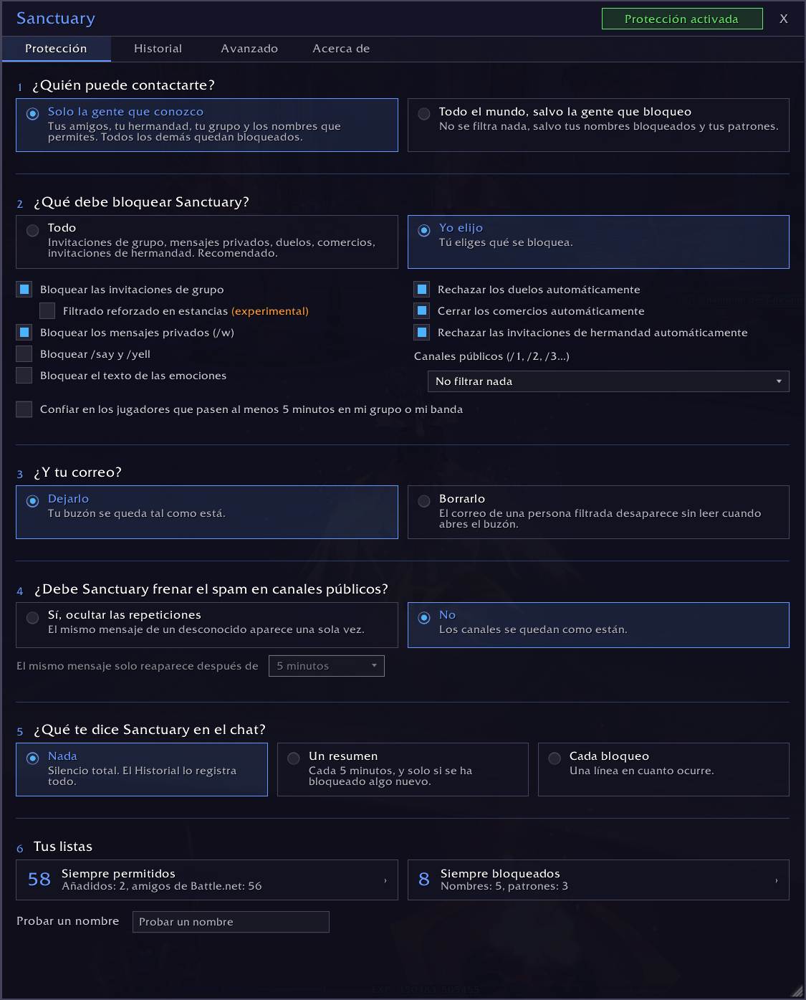
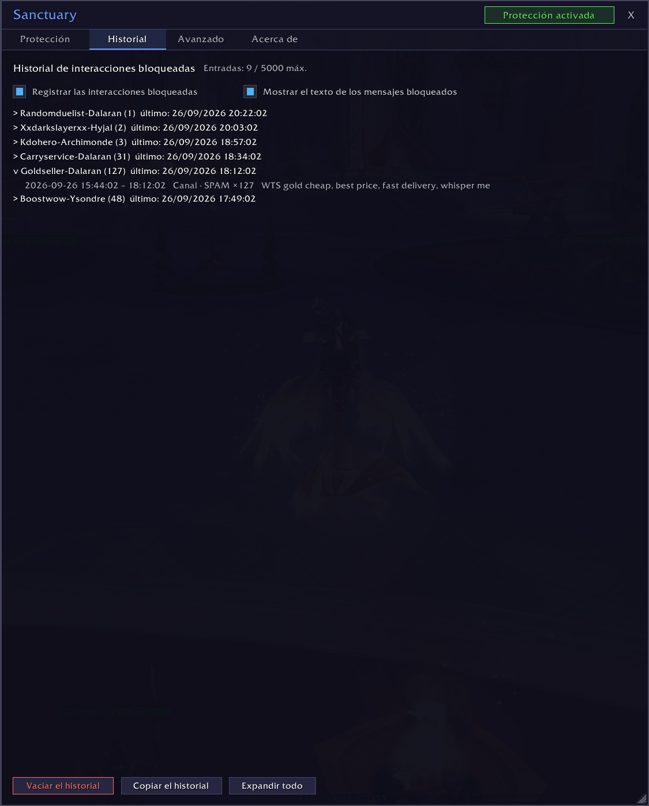
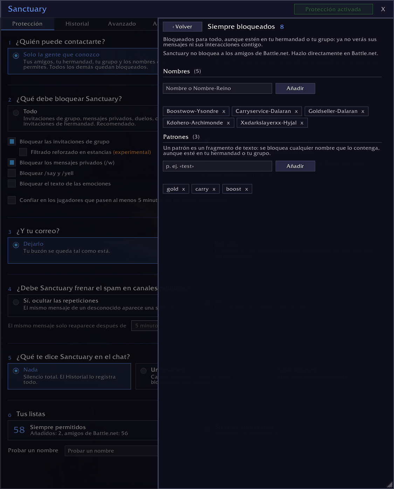
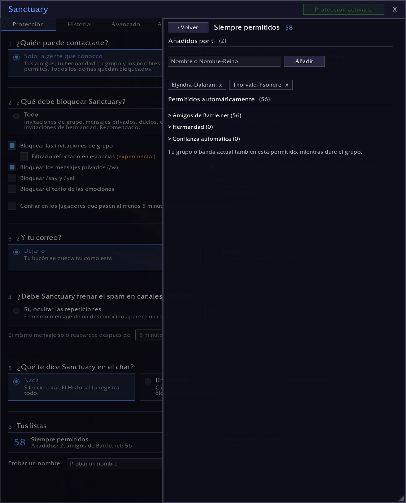

# Sanctuary

> Protección contra el acoso y el spam para World of Warcraft: Sanctuary bloquea las invitaciones, los mensajes, los susurros y otras interacciones tóxicas de jugadores malintencionados antes de que puedan molestarte.

*[English](README.md) · [Français](README.fr.md) · [Deutsch](README.de.md) · [Español](README.es.md) · [Português](README.pt-BR.md) · [Русский](README.ru.md) · [Italiano](README.it.md)*

*Esta traducción es un borrador que ningún hablante nativo ha revisado todavía. Las correcciones son bienvenidas en GitHub.*

## Qué hace Sanctuary

Por defecto, solo los jugadores que conoces pueden contactarte. Un segundo modo deja pasar a todo el mundo, salvo a los jugadores que hayas decidido bloquear, por nombre o por patrón.

Las interacciones bloqueadas no dejan rastro: ni ventana, ni mensaje, ni sonido.

**Lo que Sanctuary puede bloquear:**
- las invitaciones de grupo y de hermandad
- los susurros de personajes de WoW (nunca los de Battle.net)
- los duelos y los comercios
- /say, /yell y las emociones
- el spam en los canales públicos
- el correo de las personas filtradas, cuando abres el buzón

**Quién pasa siempre:**
- tu hermandad
- tus amigos
- tu grupo o banda actual
- los nombres que has permitido

## Por qué Sanctuary

La mayoría de los addons funcionan con una lista de jugadores bloqueados: bloqueas a un jugador y todos los demás pasan. Un acosador cambia de personaje y vuelve a empezar. Sanctuary permite lo contrario: solo pueden contactarte las personas en las que confías, y los desconocidos quedan bloqueados de entrada. También está la lista Siempre bloqueados, con patrones: basta un fragmento de nombre para bloquear a toda una familia de personajes.

El Historial guarda un registro de todo lo que se ha bloqueado, con la hora, el tipo y el mensaje. Un spam repetido cuenta una sola vez, con su número de repeticiones.

## Instalación

Lo más fácil: instala Sanctuary desde CurseForge, con la aplicación o desde la página del proyecto.

A mano:

1. Descarga este repositorio.
2. Copia la carpeta en `World of Warcraft/_retail_/Interface/AddOns/Sanctuary/`.
3. Comprueba que la carpeta se llama `Sanctuary`.
4. Reinicia WoW o escribe `/reload`.

## Uso

Haz clic en el icono de Sanctuary alrededor del minimapa, o escribe `/sanc` para abrir la ventana.

La pantalla principal hace seis preguntas: quién puede contactarte, qué debe bloquear Sanctuary, qué hace con tu correo, si hay que ocultar el spam de los canales públicos, qué te dice Sanctuary en el chat, y tus listas.

La opción Filtrado reforzado en estancias (experimental) es una casilla aparte. Cuando WoW restringe el chat (jefes de estancia, piedras angulares de Mítica+, partidas JcJ), los addons ya no pueden leer los mensajes del sistema. Con esta opción activada, mientras estés en grupo o en una estancia, Sanctuary oculta todos los mensajes del sistema, no solo las invitaciones. Actívala solo si todavía te llegan invitaciones no deseadas en una mazmorra, en una banda o en JcJ.

## Tu correo

El correo de una persona filtrada se borra cuando abres el buzón, no antes: el juego ya lo ha entregado. Para impedir que llegue a enviarse, usa la función Ignorar de Blizzard. El correo que no viene de un jugador nunca se toca. Tus otros personajes cuentan como desconocidos: añádelos a Siempre permitidos si te envías correo a ti mismo.

Por defecto, Sanctuary no toca tu correo. Si eliges que lo borre, aparecen dos ajustes: qué hace con el correo que contiene objetos o dinero, y el icono de correo en el minimapa.

El icono de correo junto al minimapa se basa en los nombres de los remitentes. Por eso, el correo de un PNJ puede hacer que el icono se oculte. Al abrir el buzón, ese correo se reconoce y no se toca.

## Tus listas

Las personas en las que confías vienen de varias fuentes, todas activas a la vez:

| Fuente | Cómo |
|--------|------|
| Hermandad | automático |
| Amigos | automático |
| Grupo o banda actual | automático, mientras dure el grupo |
| Siempre permitidos | los añades tú |
| Confianza automática | tras 5 minutos en tu grupo, si marcas la opción |

**Los nombres bloqueados y los patrones prevalecen sobre todo.** Un nombre que contiene un patrón queda bloqueado, aunque esté en tu hermandad o en tu grupo.

**Sanctuary nunca bloquea a nadie en Battle.net.** Tus amigos de Battle.net siempre pasan. Para cortar el contacto con alguien de Battle.net, hazlo en Battle.net.

## Si algo va mal

Abre la pestaña Avanzado y activa el modo de depuración. Reproduce el problema, luego copia el historial desde la pestaña Historial y pégalo en una incidencia de GitHub. No se envía nada automáticamente.

## Idiomas

Sanctuary habla inglés, francés, alemán, español (España y Latinoamérica), portugués de Brasil, ruso e italiano. Sigue el idioma de tu juego, y la pestaña Avanzado te permite elegir otro solo para Sanctuary: el juego conserva el suyo.

Las traducciones al alemán, español, portugués, ruso e italiano son borradores que ningún hablante nativo ha revisado todavía. Si una palabra suena mal, abre una incidencia o una pull request: cada idioma es un archivo en `Locales/`.

## Compatibilidad

- WoW Retail (Midnight). Classic y los demás clientes no son compatibles por ahora.
- Sin dependencias, sin bibliotecas externas.

## Licencia

[MIT](LICENSE)
