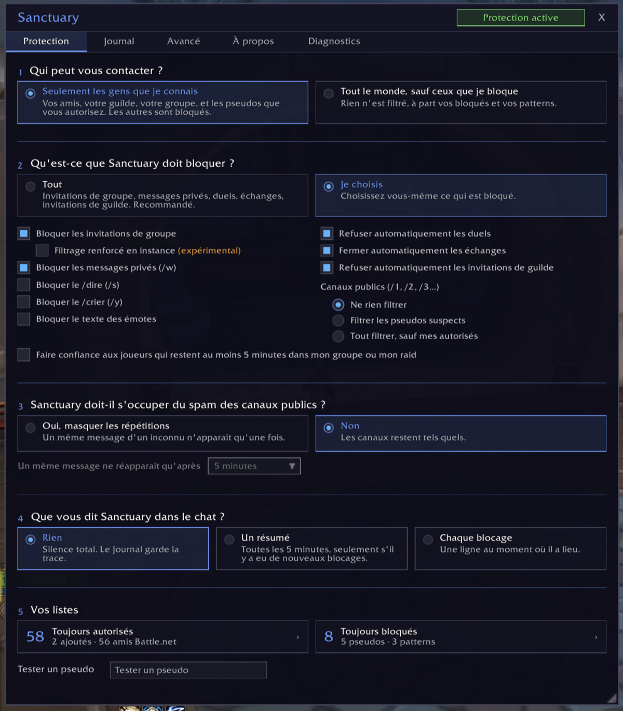
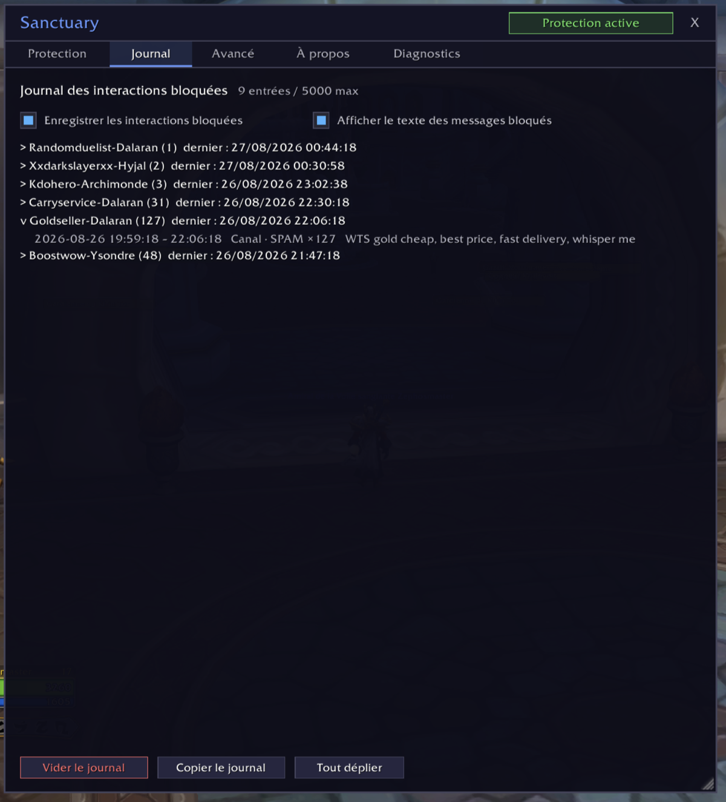
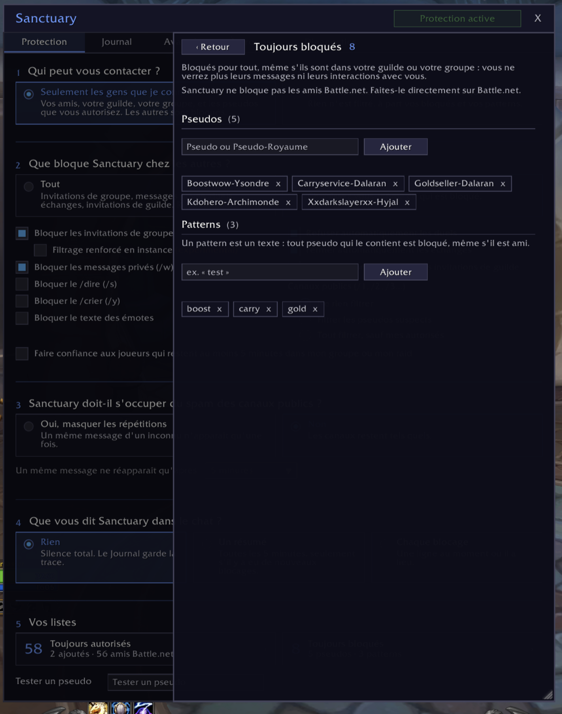
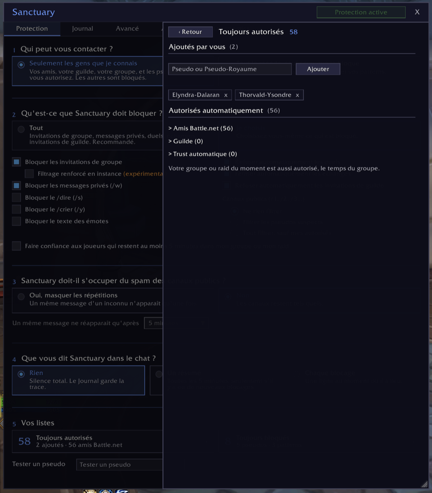

# Sanctuary

> Protection contre le harcèlement et le spam dans World of Warcraft : Sanctuary bloque les invitations, messages, chuchotements et autres interactions toxiques des personnes néfastes avant même que vous ne soyez dérangé.

*[English version](README.md)*

## Ce que fait Sanctuary

Par défaut, seuls les joueurs que vous connaissez peuvent vous contacter. Un second mode laisse tout passer, sauf les joueurs que vous avez décidé de bloquer, par pseudo ou par pattern.

Les interactions bloquées ne laissent aucune trace : pas de fenêtre, pas de message, pas de son.

**Ce que Sanctuary peut bloquer :**
- les invitations de groupe et de guilde
- les chuchotements des personnages WoW (jamais ceux de Battle.net)
- les duels et les échanges
- le /dire, le /crier et les émotes
- le spam des canaux publics
- le courrier des personnes filtrées, à l'ouverture de la boîte

**Qui passe toujours :**
- votre guilde
- vos amis
- votre groupe ou votre raid du moment
- les pseudos que vous avez autorisés

## Pourquoi Sanctuary

La plupart des add-ons fonctionnent avec une liste noire (blacklist) : vous bloquez un joueur, tous les autres passent. Un harceleur change de personnage et recommence. Sanctuary permet l'inverse : seules les personnes de confiance vous atteignent, les inconnus sont bloqués d'office. La liste noire existe aussi, avec des patterns : un morceau de pseudo suffit à bloquer toute une famille de personnages.

Le Journal garde la trace de tout ce qui a été bloqué, avec l'heure, le type et le message. Un spam répété ne compte qu'une fois, avec son nombre de répétitions.

## Installation

Le plus simple : installez Sanctuary depuis CurseForge, avec l'application ou depuis la page du projet.

À la main :

1. Téléchargez ce dépôt.
2. Copiez le dossier dans `World of Warcraft/_retail_/Interface/AddOns/Sanctuary/`.
3. Vérifiez que le dossier s'appelle bien `Sanctuary`.
4. Relancez WoW ou tapez `/reload`.

## Utilisation

Cliquez sur l'icône de Sanctuary autour de la minicarte, ou tapez `/sanc` pour ouvrir la fenêtre.

L'écran principal pose six questions : qui peut vous contacter, ce que Sanctuary doit bloquer, ce qu'il fait du courrier, s'il faut masquer le spam des canaux publics, ce que Sanctuary vous dit dans le chat, et vos listes.

Le filtrage renforcé en instance (expérimental) est une case à part. Quand WoW verrouille le chat (boss d'instance, clés mythiques, matchs JcJ), les add-ons ne peuvent plus lire les messages système. En activant cette option, tant que vous êtes en groupe ou en instance, Sanctuary masque tous les messages système, pas seulement les invitations. Ne l'activez que si des invitations indésirables vous parviennent encore en donjon, en raid ou en JcJ.

## Le courrier

Le courrier d'une personne filtrée est supprimé à l'ouverture de la boîte aux lettres, pas avant : le jeu l'a déjà livré. Pour empêcher l'envoi, utilisez l'Ignorer de Blizzard. Un courrier qui ne vient pas d'un joueur n'est jamais touché. Vos autres personnages comptent comme des inconnus : ajoutez-les à Toujours autorisés si vous vous envoyez du courrier.

Par défaut Sanctuary n'y touche pas. Si vous choisissez de le supprimer, deux réglages apparaissent : ce qu'il fait des courriers contenant des objets ou de l'argent, et l'icône de courrier sur la minicarte.

L'icône de courrier près de la minicarte se fie aux noms des expéditeurs. Un courrier de PNJ peut donc la cacher. À l'ouverture de la boîte aux lettres, il est reconnu et laissé.

## Vos listes

Les personnes de confiance viennent de plusieurs sources, toutes actives en même temps :

| Source | Comment |
|--------|---------|
| Guilde | automatique |
| Amis | automatique |
| Groupe ou raid du moment | automatique, le temps du groupe |
| Toujours autorisés | vous les ajoutez |
| Trust automatique | après 5 minutes dans votre groupe, si vous cochez l'option |

**Les bloqués et les patterns priment sur tout.** Un pseudo qui contient un pattern est bloqué, même dans votre guilde ou votre groupe.

**Sanctuary ne bloque jamais personne sur Battle.net.** Vos amis Battle.net passent toujours. Pour couper un contact Battle.net, faites-le dans Battle.net.

## En cas de problème

Ouvrez l'onglet Avancé et activez le mode debug. Reproduisez le problème, puis copiez le journal depuis l'onglet Journal et collez-le dans une issue GitHub. Rien n'est envoyé automatiquement.

## Compatibilité

- WoW Retail (Midnight). Classic et les autres clients ne sont pas pris en charge pour le moment.
- Aucune dépendance, aucune bibliothèque externe.

## Licence

[MIT](LICENSE)
