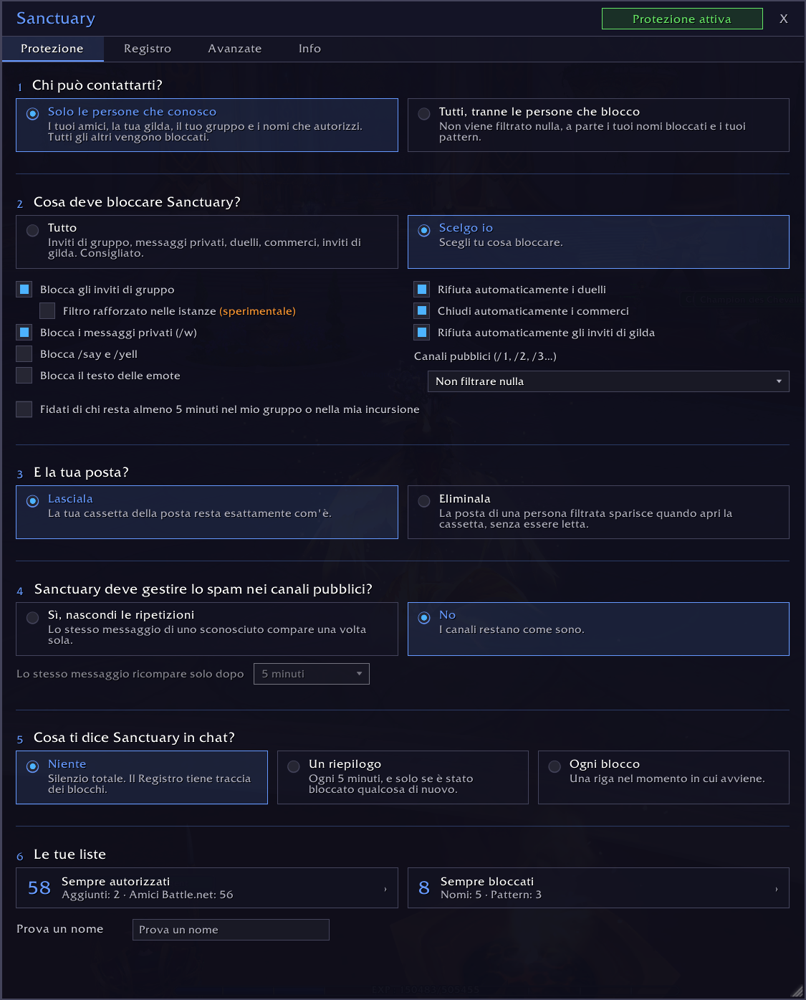
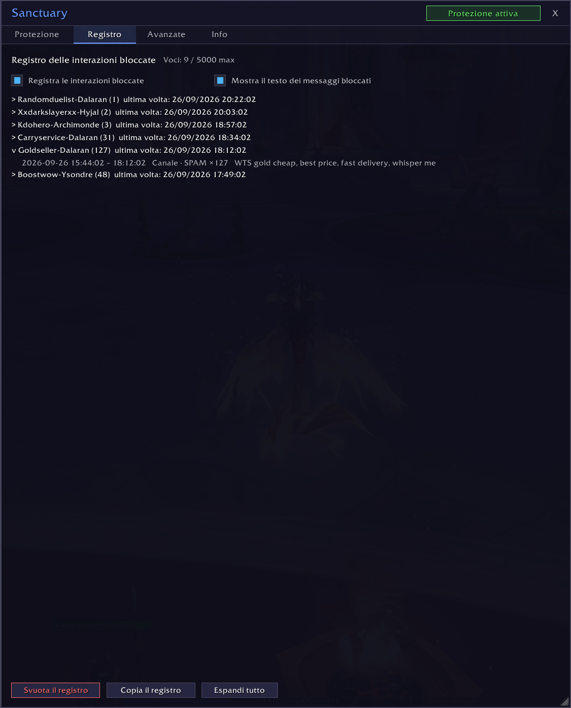
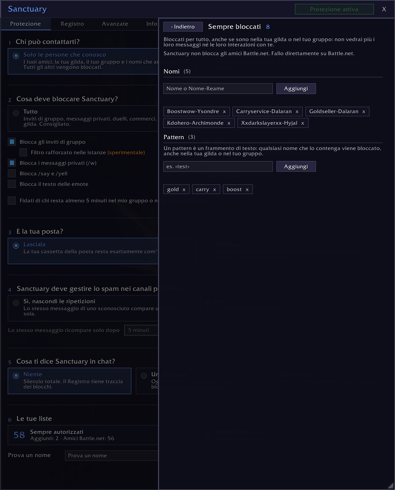
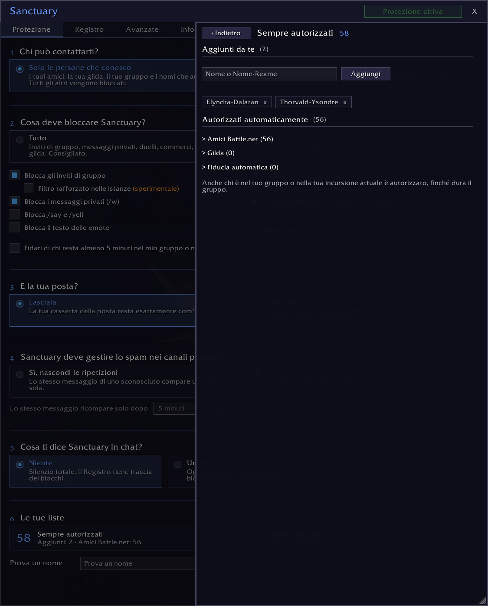

# Sanctuary

> Protezione contro molestie e spam per World of Warcraft: Sanctuary blocca inviti, messaggi, sussurri e altre interazioni tossiche dei giocatori malintenzionati prima che possano disturbarti.

*[English](README.md) · [Français](README.fr.md) · [Deutsch](README.de.md) · [Español](README.es.md) · [Português](README.pt-BR.md) · [Русский](README.ru.md) · [Italiano](README.it.md)*

*Questa traduzione è una bozza che nessun madrelingua ha ancora rivisto. Le correzioni sono benvenute su GitHub.*

## Cosa fa Sanctuary

Per impostazione predefinita, solo i giocatori che conosci possono contattarti. Una seconda modalità lascia passare tutti, tranne i giocatori che hai deciso di bloccare, per nome o per pattern.

Le interazioni bloccate non lasciano traccia: nessuna finestra, nessun messaggio, nessun suono.

**Cosa può bloccare Sanctuary:**
- gli inviti di gruppo e di gilda
- i sussurri dei personaggi di WoW (mai quelli di Battle.net)
- i duelli e i commerci
- /say, /yell e le emote
- lo spam nei canali pubblici
- la posta delle persone filtrate, quando apri la cassetta della posta

**Chi passa sempre:**
- la tua gilda
- i tuoi amici
- il tuo gruppo o la tua incursione attuale
- i nomi che hai autorizzato

## Perché Sanctuary

La maggior parte degli add-on funziona con una lista di giocatori bloccati: blocchi un giocatore, tutti gli altri passano. Chi ti molesta cambia personaggio e ricomincia. Sanctuary permette il contrario: solo le persone di cui ti fidi possono raggiungerti, gli sconosciuti vengono bloccati in partenza. C'è anche la lista Sempre bloccati, con i pattern: basta un pezzo di nome per bloccare un'intera famiglia di personaggi.

Il Registro tiene traccia di tutto ciò che è stato bloccato, con l'ora, il tipo e il messaggio. Uno spam ripetuto conta una volta sola, con il suo numero di ripetizioni.

## Installazione

Il modo più semplice: installa Sanctuary da CurseForge, con l'app o dalla pagina del progetto.

A mano:

1. Scarica questo repository.
2. Copia la cartella in `World of Warcraft/_retail_/Interface/AddOns/Sanctuary/`.
3. Controlla che la cartella si chiami `Sanctuary`.
4. Riavvia WoW o digita `/reload`.

## Utilizzo

Clicca sull'icona di Sanctuary attorno alla minimappa, oppure digita `/sanc` per aprire la finestra.

La schermata principale pone sei domande: chi può contattarti, cosa deve bloccare Sanctuary, cosa fa con la tua posta, se nascondere lo spam dei canali pubblici, cosa ti dice Sanctuary in chat e le tue liste.

L'opzione Filtro rafforzato nelle istanze (sperimentale) è una casella a parte. Quando WoW limita la chat (boss delle istanze, spedizioni Mitiche+, partite PvP), gli add-on non possono più leggere i messaggi di sistema. Con questa opzione attiva, finché sei in gruppo o in un'istanza, Sanctuary nasconde tutti i messaggi di sistema, non solo gli inviti. Attivala solo se ricevi ancora inviti indesiderati in una spedizione, in un'incursione o in PvP.

## La tua posta

La posta di una persona filtrata viene eliminata quando apri la cassetta della posta, non prima: il gioco l'ha già consegnata. Per impedire che venga inviata, usa la funzione Ignora di Blizzard. La posta che non proviene da un giocatore non viene mai toccata. Gli altri tuoi personaggi contano come sconosciuti: aggiungili a Sempre autorizzati se mandi posta a te stesso.

Per impostazione predefinita, Sanctuary non tocca la tua posta. Se scegli di farla eliminare, compaiono due impostazioni: cosa fa con la posta che contiene oggetti o denaro, e l'icona della posta sulla minimappa.

L'icona della posta accanto alla minimappa si basa sui nomi dei mittenti. La posta di un PNG può quindi nascondere l'icona. Quando apri la cassetta della posta, quella posta viene riconosciuta e lasciata dov'è.

## Le tue liste

Le persone di cui ti fidi provengono da più fonti, tutte attive nello stesso momento:

| Fonte | Come |
|-------|------|
| Gilda | automaticamente |
| Amici | automaticamente |
| Gruppo o incursione attuale | automaticamente, finché dura il gruppo |
| Sempre autorizzati | li aggiungi tu |
| Fiducia automatica | dopo 5 minuti nel tuo gruppo, se spunti l'opzione |

**I nomi bloccati e i pattern hanno la precedenza su tutto.** Un nome che contiene un pattern viene bloccato, anche nella tua gilda o nel tuo gruppo.

**Sanctuary non blocca mai nessuno su Battle.net.** I tuoi amici Battle.net passano sempre. Per tagliare fuori un contatto Battle.net, fallo su Battle.net.

## Se qualcosa non va

Apri la scheda Avanzate e attiva la modalità debug. Riproduci il problema, poi copia il registro dalla scheda Registro e incollalo in una issue su GitHub. Non viene inviato nulla in automatico.

## Lingue

Sanctuary parla inglese, francese, tedesco, spagnolo (Spagna e America Latina), portoghese brasiliano, russo e italiano. Segue la lingua del tuo gioco, e la scheda Avanzate ti permette di sceglierne un'altra solo per Sanctuary: il gioco mantiene la sua.

Le traduzioni in tedesco, spagnolo, portoghese, russo e italiano sono bozze che nessun madrelingua ha ancora rivisto. Se una parola suona male, apri una issue o una pull request: ogni lingua è un file in `Locales/`.

## Compatibilità

- WoW Retail (Midnight). Classic e gli altri client per ora non sono supportati.
- Nessuna dipendenza, nessuna libreria esterna.

## Licenza

[MIT](LICENSE)
