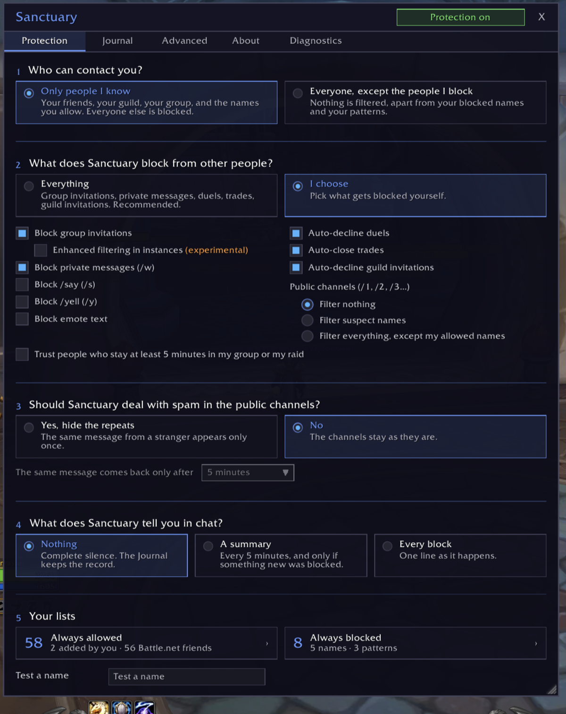
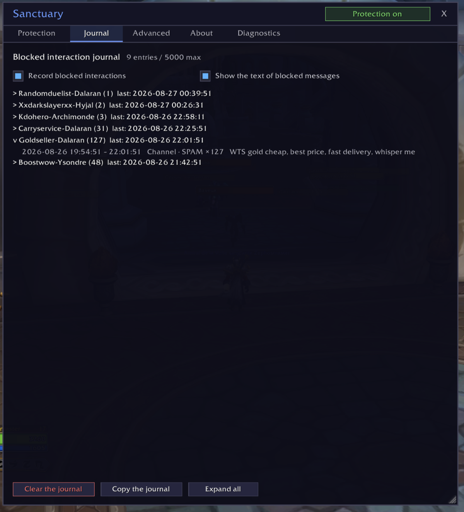
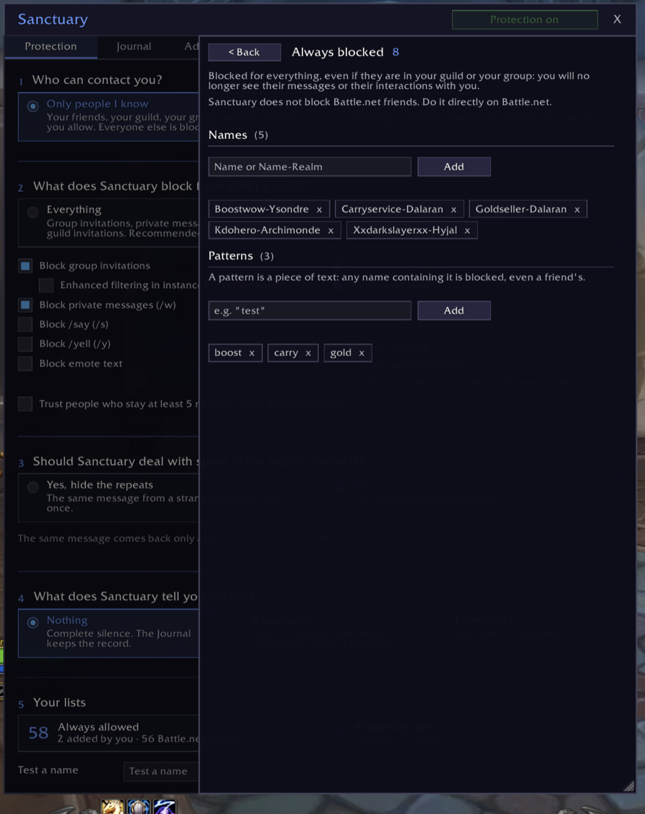
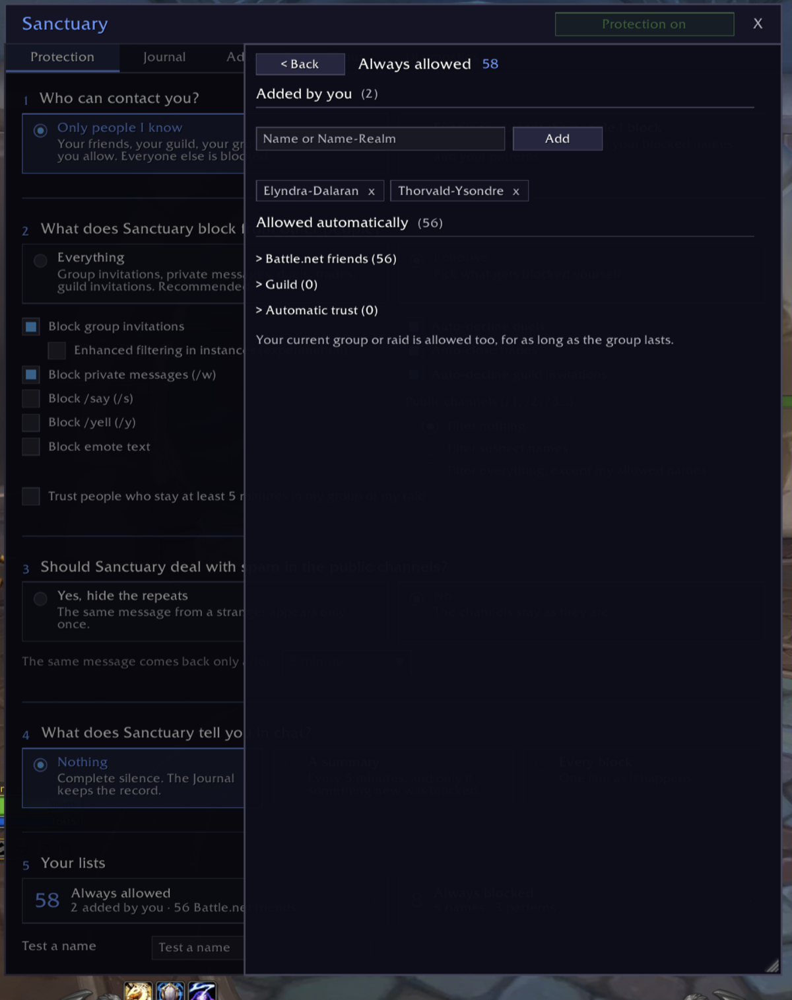

# Sanctuary

> Anti-harassment and anti-spam protection for World of Warcraft: Sanctuary blocks invitations, messages, whispers and other toxic interactions from harmful players before they can bother you.

*[Version française](README.fr.md)*

## What Sanctuary does

By default, only the players you know can contact you. A second mode lets everyone through, except the players you have decided to block, by name or by pattern.

Blocked interactions leave no trace: no window, no message, no sound.

**What Sanctuary can block:**
- group and guild invitations
- whispers from WoW characters (never Battle.net ones)
- duels and trades
- /say, /yell and emotes
- spam in the public channels
- mail from filtered people, when you open the mailbox

**Who always gets through:**
- your guild
- your friends
- your current group or raid
- the names you have allowed

## Why Sanctuary

Most add-ons work with a blacklist: you block one player, everyone else gets through. A harasser switches characters and starts again. Sanctuary allows the opposite: only the people you trust can reach you, strangers are blocked outright. The blacklist is there too, with patterns: a piece of a name is enough to block a whole family of characters.

The Journal keeps a record of everything that was blocked, with the time, the type and the message. A repeated spam counts once, with its number of repeats.

## Installation

The easiest way: install Sanctuary from CurseForge, with the app or from the project page.

By hand:

1. Download this repository.
2. Copy the folder to `World of Warcraft/_retail_/Interface/AddOns/Sanctuary/`.
3. Make sure the folder is named `Sanctuary`.
4. Restart WoW or type `/reload`.

## Usage

Click the Sanctuary icon around the minimap, or type `/sanc` to open the window.

The main screen asks six questions: who can contact you, what Sanctuary should block, what it does with your mail, whether to hide the spam of the public channels, what Sanctuary tells you in chat, and your lists.

Enhanced filtering in instances (experimental) is a box of its own. When WoW locks the chat down (instance bosses, Mythic+ keys, PvP matches), add-ons can no longer read system messages. With this option on, while you are grouped or in an instance, Sanctuary hides every system message, not only invitations. Turn it on only if unwanted invitations still reach you in a dungeon, a raid or PvP.

## Your mail

Mail from a filtered person is deleted when you open the mailbox, not before: the game has already delivered it. To stop it being sent at all, use Blizzard's Ignore. Mail that did not come from a player is never touched. Your other characters count as strangers: add them to Always allowed if you send yourself mail.

Sanctuary leaves your mail alone by default. If you choose to have it deleted, two settings appear: what it does with mail that has items or money in it, and the mail icon on the minimap.

## Your lists

The people you trust come from several sources, all active at the same time:

| Source | How |
|--------|-----|
| Guild | automatic |
| Friends | automatic |
| Current group or raid | automatic, for as long as the group lasts |
| Always allowed | you add them |
| Automatic trust | after 5 minutes in your group, if you tick the option |

**Blocked names and patterns win over everything.** A name containing a pattern is blocked, even in your guild or your group.

**Sanctuary never blocks anyone on Battle.net.** Your Battle.net friends always get through. To cut a Battle.net contact off, do it in Battle.net.

## If something goes wrong

Open the Advanced tab and turn debug mode on. Reproduce the problem, then copy the journal from the Journal tab and paste it into a GitHub issue. Nothing is sent automatically.

## Compatibility

- WoW Retail (Midnight). Classic and the other clients are not supported for now.
- No dependencies, no external library.

## License

[MIT](LICENSE)
