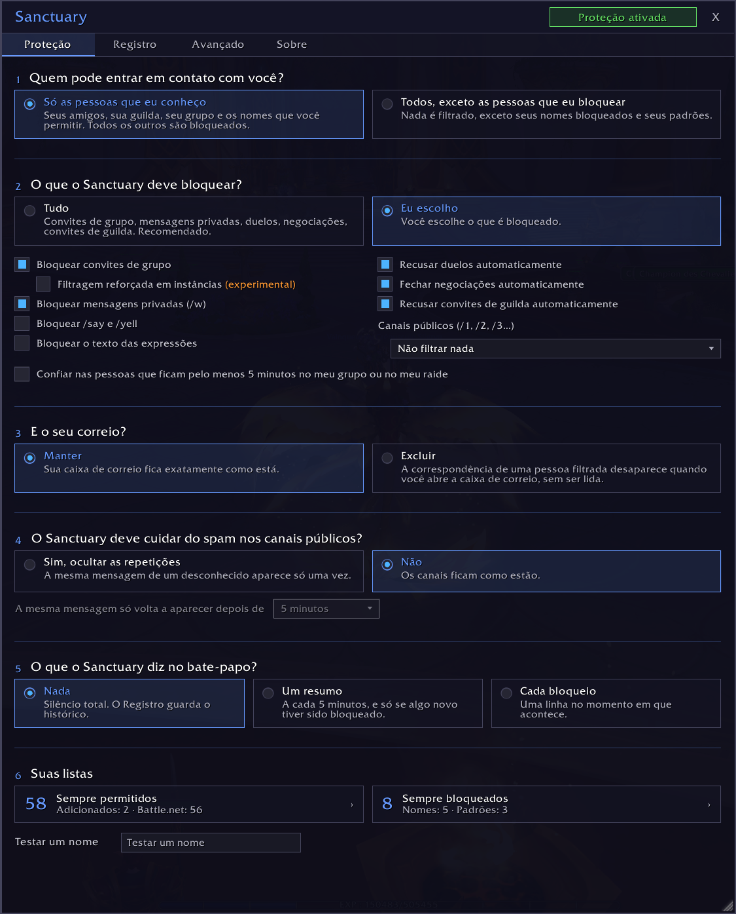
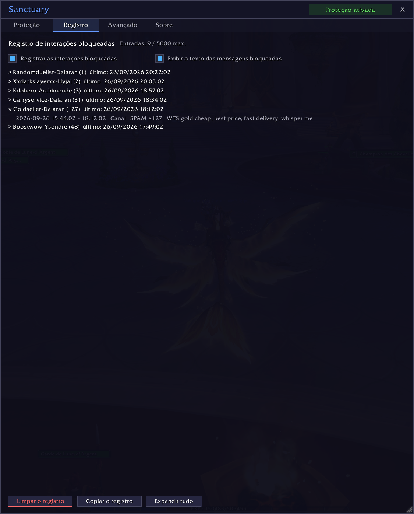
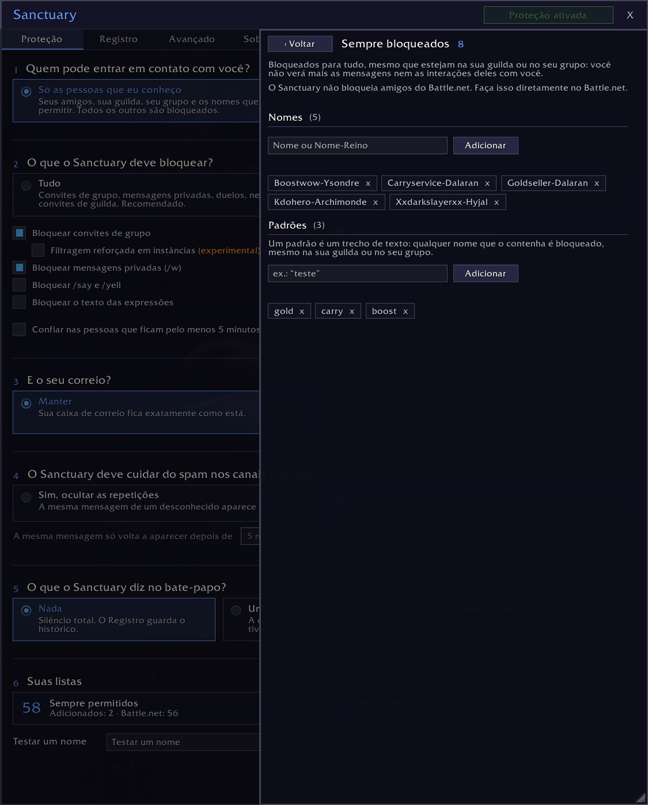
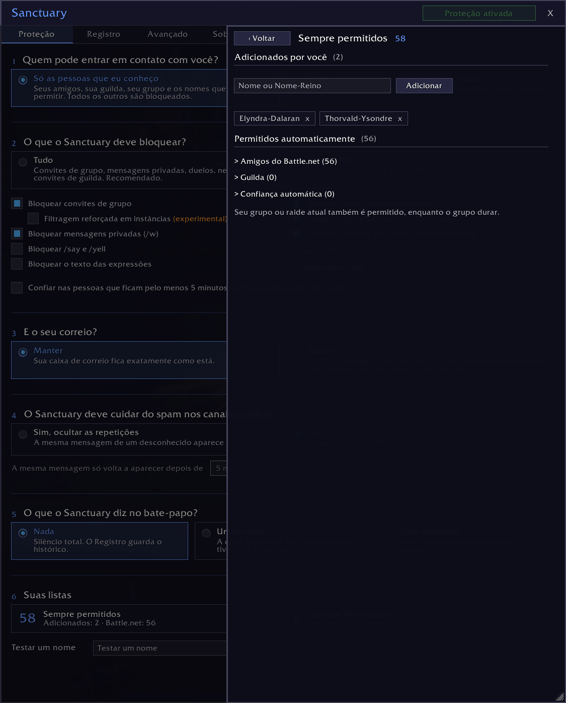

# Sanctuary

> Proteção contra assédio e spam para World of Warcraft: o Sanctuary bloqueia convites, mensagens, sussurros e outras interações tóxicas de jogadores mal-intencionados antes que eles possam incomodar você.

*[English](README.md) · [Français](README.fr.md) · [Deutsch](README.de.md) · [Español](README.es.md) · [Português](README.pt.md) · [Русский](README.ru.md) · [Italiano](README.it.md)*

*Esta tradução é um rascunho que nenhum falante nativo revisou ainda. Correções são bem-vindas no GitHub.*

## O que o Sanctuary faz

Por padrão, só os jogadores que você conhece podem entrar em contato com você. Um segundo modo deixa todo mundo passar, exceto os jogadores que você decidiu bloquear, por nome ou por um padrão.

As interações bloqueadas não deixam rastro: nenhuma janela, nenhuma mensagem, nenhum som.

**O que o Sanctuary pode bloquear:**
- convites de grupo e de guilda
- sussurros de personagens do WoW (nunca os do Battle.net)
- duelos e negociações
- /say, /yell e expressões
- spam nos canais públicos
- correspondências de pessoas filtradas, quando você abre a caixa de correio

**Quem sempre passa:**
- sua guilda
- seus amigos
- seu grupo ou raide atual
- os nomes que você permitiu

## Por que o Sanctuary

A maioria dos addons funciona com uma lista de jogadores bloqueados: você bloqueia um jogador, todos os outros passam. Quem assedia troca de personagem e começa de novo. O Sanctuary permite o contrário: só as pessoas em quem você confia conseguem chegar até você, e os desconhecidos são bloqueados de imediato. A lista Sempre bloqueados também existe, com padrões: um pedaço de nome basta para bloquear toda uma família de personagens.

O Registro guarda um histórico de tudo o que foi bloqueado, com a hora, o tipo e a mensagem. Um spam repetido conta uma vez só, com o número de repetições.

## Instalação

O jeito mais fácil: instale o Sanctuary pelo CurseForge, com o aplicativo ou pela página do projeto.

Manualmente:

1. Baixe este repositório.
2. Copie a pasta para `World of Warcraft/_retail_/Interface/AddOns/Sanctuary/`.
3. Verifique se a pasta se chama `Sanctuary`.
4. Reinicie o WoW ou digite `/reload`.

## Como usar

Clique no ícone do Sanctuary ao redor do minimapa ou digite `/sanc` para abrir a janela.

A tela principal faz seis perguntas: quem pode entrar em contato com você, o que o Sanctuary deve bloquear, o que ele faz com o seu correio, se deve ocultar o spam dos canais públicos, o que o Sanctuary diz a você no bate-papo e as suas listas.

A Filtragem reforçada em instâncias (experimental) é uma caixa de seleção à parte. Quando o WoW restringe o bate-papo (chefes de instância, chaves Míticas+, partidas JxJ), os addons não conseguem mais ler as mensagens do sistema. Com esta opção ativada, enquanto você estiver em grupo ou em uma instância, o Sanctuary oculta todas as mensagens do sistema, não só os convites. Ative só se convites indesejados ainda chegarem até você em uma masmorra, em um raide ou no JxJ.

## Seu correio

A correspondência de uma pessoa filtrada é excluída quando você abre a caixa de correio, não antes: o jogo já a entregou. Para que ela nem seja enviada, use a função Ignorar da Blizzard. Uma correspondência que não veio de um jogador nunca é tocada. Seus outros personagens contam como desconhecidos: adicione-os à lista Sempre permitidos se você envia correspondências para si mesmo.

Por padrão, o Sanctuary não mexe no seu correio. Se você escolher excluí-lo, aparecem duas configurações: o que ele faz com correspondências que têm itens ou dinheiro, e o ícone de correio no minimapa.

O ícone de correio ao lado do minimapa se baseia nos nomes dos remetentes. Por isso, uma correspondência de PNJ pode ocultá-lo. Quando você abre a caixa de correio, ela é reconhecida e deixada como está.

## Suas listas

As pessoas em quem você confia vêm de várias fontes, todas ativas ao mesmo tempo:

| Fonte | Como |
|-------|------|
| Guilda | automaticamente |
| Amigos | automaticamente |
| Grupo ou raide atual | automaticamente, enquanto o grupo durar |
| Sempre permitidos | você as adiciona |
| Confiança automática | após 5 minutos no seu grupo, se você marcar a opção |

**Nomes bloqueados e padrões têm prioridade sobre tudo.** Um nome que contém um padrão é bloqueado, mesmo na sua guilda ou no seu grupo.

**O Sanctuary nunca bloqueia ninguém no Battle.net.** Seus amigos do Battle.net sempre passam. Para cortar contato com alguém do Battle.net, faça isso no Battle.net.

## Se algo der errado

Abra a aba Avançado e ative o modo debug. Reproduza o problema, depois copie o registro pela aba Registro e cole em uma issue no GitHub. Nada é enviado automaticamente.

## Idiomas

O Sanctuary fala inglês, francês, alemão, espanhol (Espanha e América Latina), português do Brasil, russo e italiano. Ele segue o idioma do seu jogo, e a aba Avançado permite escolher outro só para o Sanctuary: o jogo mantém o próprio idioma.

As traduções em alemão, espanhol, português, russo e italiano são rascunhos que nenhum falante nativo revisou ainda. Se uma palavra soar estranha, abra uma issue ou um pull request: cada idioma é um arquivo em `Locales/`.

## Compatibilidade

- WoW Retail (Midnight). O Classic e os outros clientes não têm suporte por enquanto.
- Sem dependências, sem biblioteca externa.

## Licença

[MIT](LICENSE)
