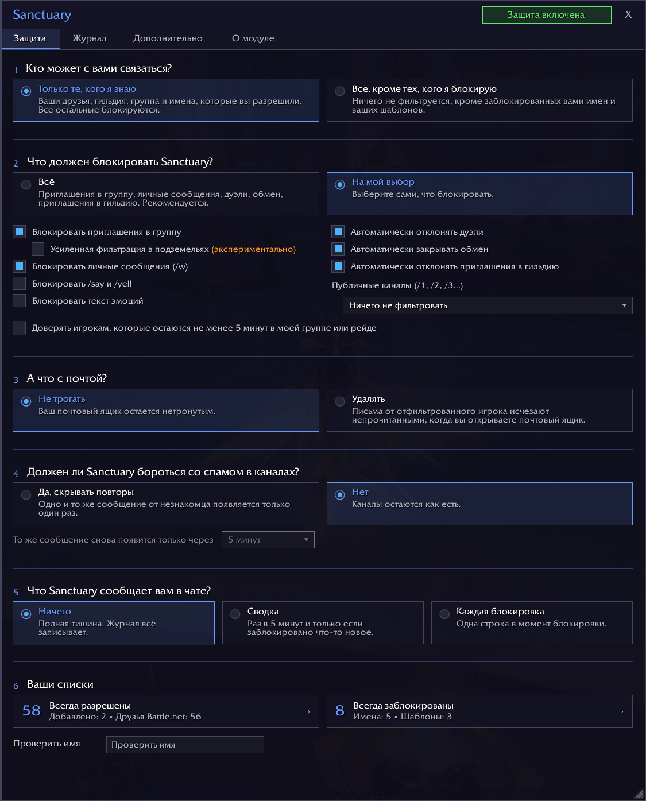
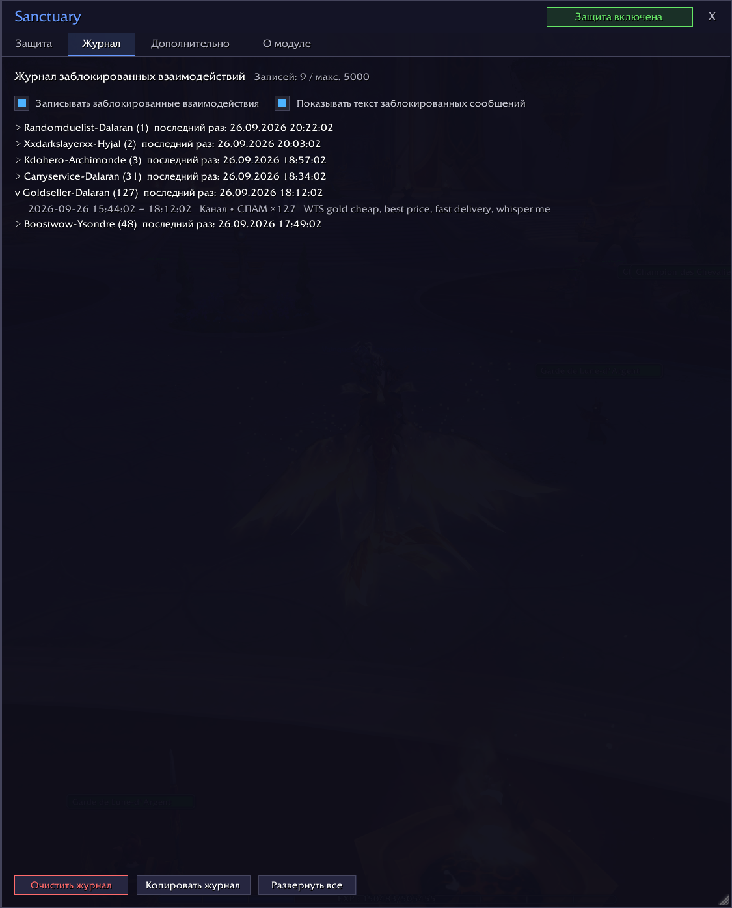
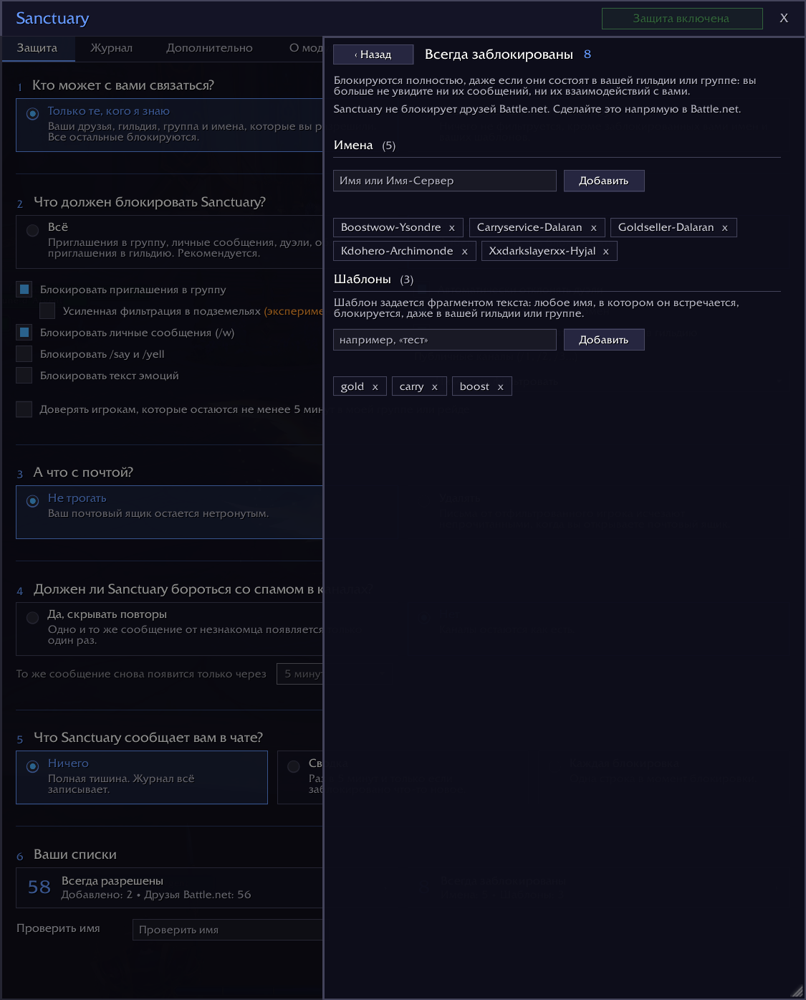
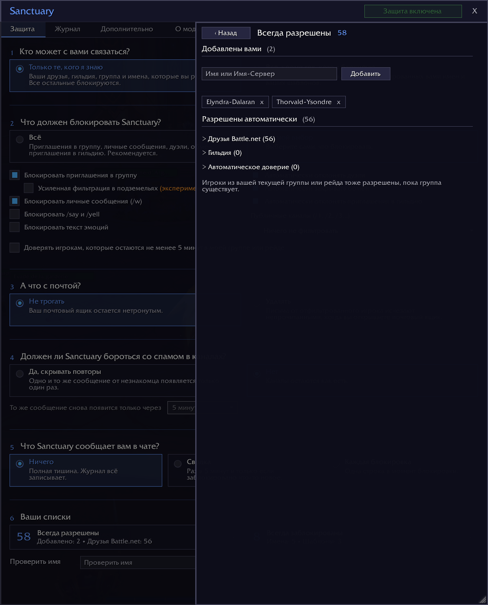

# Sanctuary

> Защита от преследований и спама для World of Warcraft: Sanctuary блокирует приглашения, сообщения, шепот и другие токсичные взаимодействия от недоброжелательных игроков, прежде чем они успеют вас побеспокоить.

*[English](README.md) · [Français](README.fr.md) · [Deutsch](README.de.md) · [Español](README.es.md) · [Português](README.pt.md) · [Русский](README.ru.md) · [Italiano](README.it.md)*

*Это черновик перевода, который еще не проверил ни один носитель языка. Исправления приветствуются на GitHub.*

## Что делает Sanctuary

По умолчанию связаться с вами могут только знакомые вам игроки. Второй режим пропускает всех, кроме игроков, которых вы решили заблокировать, по имени или по шаблону.

Заблокированные взаимодействия не оставляют следов: ни окна, ни сообщения, ни звука.

**Что Sanctuary может блокировать:**
- приглашения в группу и в гильдию
- шепот от персонажей WoW (но никогда не из Battle.net)
- дуэли и обмен
- /say, /yell и эмоции
- спам в публичных каналах
- почту от отфильтрованных игроков, когда вы открываете почтовый ящик

**Кто всегда проходит фильтр:**
- ваша гильдия
- ваши друзья
- ваша текущая группа или рейд
- имена, которые вы разрешили

## Почему Sanctuary

Большинство модификаций работает со списком заблокированных игроков: вы блокируете одного игрока, все остальные проходят. Обидчик меняет персонажа и начинает снова. Sanctuary позволяет сделать наоборот: связаться с вами могут только те, кому вы доверяете, а незнакомцы блокируются сразу. Список «Всегда заблокированы» тоже есть, причем с шаблонами: части имени достаточно, чтобы заблокировать целое семейство персонажей.

Журнал хранит записи обо всем, что было заблокировано, с указанием времени, типа и сообщения. Повторяющийся спам записывается один раз, вместе с числом повторов.

## Установка

Самый простой способ: установите Sanctuary с CurseForge, через приложение или со страницы проекта.

Вручную:

1. Скачайте этот репозиторий.
2. Скопируйте папку в `World of Warcraft/_retail_/Interface/AddOns/Sanctuary/`.
3. Убедитесь, что папка называется `Sanctuary`.
4. Перезапустите WoW или введите `/reload`.

## Использование

Щелкните по значку Sanctuary у мини-карты или введите `/sanc`, чтобы открыть окно.

Главный экран задает шесть вопросов: кто может с вами связаться, что должен блокировать Sanctuary, что он делает с вашей почтой, скрывать ли спам в публичных каналах, что Sanctuary сообщает вам в чате и ваши списки.

Параметр «Усиленная фильтрация в подземельях (экспериментально)» включается отдельным флажком. Когда WoW ограничивает чат (бои с боссами в подземельях, эпохальные ключи, PvP-матчи), модификации больше не могут читать системные сообщения. Если этот параметр включен и вы в группе или в подземелье, Sanctuary скрывает все системные сообщения, а не только приглашения. Включайте его, только если нежелательные приглашения по-прежнему приходят вам в подземелье, в рейде или в PvP.

## Ваша почта

Письма от отфильтрованного игрока удаляются, когда вы открываете почтовый ящик, а не раньше: игра их уже доставила. Чтобы их вообще не отправляли, используйте функцию Blizzard «Игнорировать». Письма, пришедшие не от игрока, никогда не затрагиваются. Другие ваши персонажи считаются незнакомцами: добавьте их в список «Всегда разрешены», если вы отправляете себе письма.

По умолчанию Sanctuary не трогает вашу почту. Если вы решите ее удалять, появятся два параметра: что Sanctuary делает с письмами, в которых есть предметы или деньги, и значок почты у мини-карты.

Значок почты у мини-карты ориентируется на имена отправителей. Поэтому письмо от НИП может его скрыть. Когда вы открываете почтовый ящик, такое письмо распознается и остается нетронутым.

## Ваши списки

Список тех, кому вы доверяете, складывается из нескольких источников, и все они действуют одновременно:

| Источник | Как |
|--------|-----|
| Гильдия | автоматически |
| Друзья | автоматически |
| Текущая группа или рейд | автоматически, пока существует группа |
| Всегда разрешены | вы добавляете их сами |
| Автоматическое доверие | через 5 минут в вашей группе, если вы отметили этот параметр |

**Заблокированные имена и шаблоны имеют приоритет над всем остальным.** Имя, в котором встречается шаблон, блокируется, даже в вашей гильдии или группе.

**Sanctuary никогда никого не блокирует в Battle.net.** Ваши друзья Battle.net всегда проходят. Чтобы оборвать связь с контактом Battle.net, сделайте это в самом Battle.net.

## Если что-то пошло не так

Откройте вкладку «Дополнительно» и включите режим отладки. Воспроизведите проблему, затем скопируйте журнал на вкладке «Журнал» и вставьте его в issue на GitHub. Ничего не отправляется автоматически.

## Языки

Sanctuary говорит на английском, французском, немецком, испанском (Испания и Латинская Америка), бразильском португальском, русском и итальянском языках. Он использует язык вашей игры, а на вкладке «Дополнительно» можно выбрать другой язык только для Sanctuary: язык самой игры не меняется.

Немецкий, испанский, португальский, русский и итальянский переводы пока черновые: их еще не проверил ни один носитель языка. Если какое-то слово звучит не так, откройте issue или pull request: каждый язык хранится в одном файле в `Locales/`.

## Совместимость

- WoW Retail (Midnight). Classic и другие клиенты пока не поддерживаются.
- Никаких зависимостей, никаких внешних библиотек.

## Лицензия

[MIT](LICENSE)
